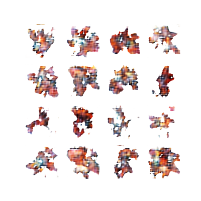
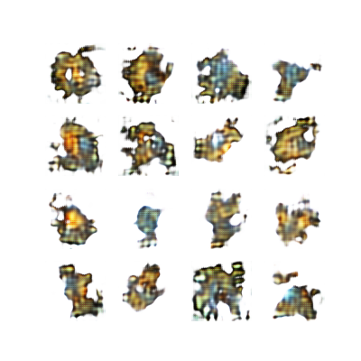
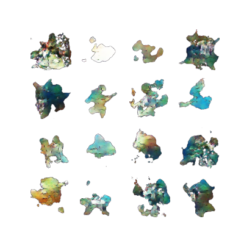
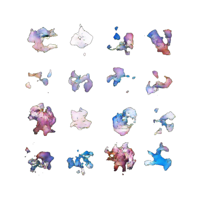

# pokegan-gsc

Inspired by [moxiegushi's](https://github.com/moxiegushi) [pokeGAN](https://github.com/moxiegushi/pokeGAN). After seeing it in [this video](https://www.youtube.com/watch?v=yz6dNf7X7SA) a while back, I decided to take a crack at it for nostalgia's sake.

[`v1-v3/`](./v1-v3/) includes my first 2 attempts from ~2021, plus a 2023 follow-up.

[`v4-v6/`](./v4-v6/) is based on that follow-up using both official art and in-game sprites in the training set.

## Results
I wouldn't call them "good", but a few were interesting:

These were more or less the best of the bunch, which notably all came from version 3. Versions 4 and 6 converged on "solutions" where they drew the same image every time, and version 5 could only produce static. My main takeaway is to keep the art and sprites separate for v7.